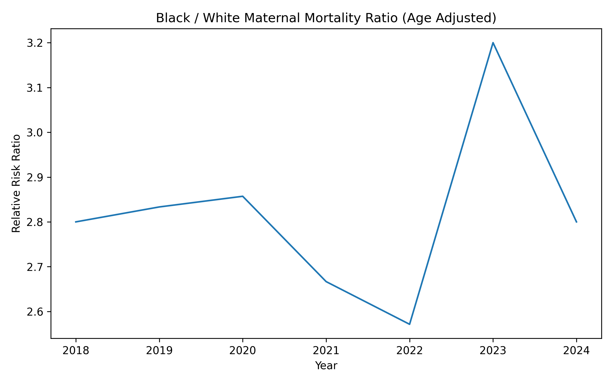

# Maternal Mortality Racial Disparities (CDC WONDER, 2018–2024)

*An epidemiologic analysis of racial disparities in U.S. maternal mortality using CDC WONDER data (2018–2024).*

## Overview

This analysis extends CDC WONDER maternal mortality data through 2024, capturing post-pandemic trends not covered in prior reporting. The 2023 increase in the Black–White relative disparity ratio — despite declining absolute rates for both groups — represents a finding absent from coverage based on the 2022 CDC data release.

Maternal mortality is a critical indicator of population-level health equity and health system performance.

The figure below displays the temporal trend in the age-adjusted Black–White maternal mortality ratio (CDC WONDER, 2018–2024). Ratios above 1 indicate disproportionate risk among Black women relative to White women.

---
## Public Health Significance

Maternal mortality is widely used as a sentinel indicator of healthcare system performance, access to care, and structural inequities. Persistent racial disparities in maternal outcomes reflect complex interactions between social determinants of health, healthcare quality, and systemic inequity.

Understanding both absolute and relative disparities is essential for accurate interpretation of trends — and, as shown below, these two measures can move in opposite directions in the same year.

---

## Research Objectives

- Evaluate temporal trends in maternal mortality  
- Quantify absolute disparity (rate difference)  
- Quantify relative disparity (rate ratio)  
- Assess whether trends differ by race using linear regression with interaction  

---

## Data Source

- CDC WONDER Multiple Cause of Death database  
- ICD-10 codes O00–O99 (pregnancy, childbirth, and the puerperium)  
- Age-adjusted mortality rate per 100,000 population  

Raw CDC data files are not included in this repository due to size and licensing constraints.

---

## Methods

A retrospective descriptive analysis was conducted using annual national mortality data. Disparities were evaluated using both absolute and relative measures.

Temporal trends were assessed using ordinary least squares (OLS) regression, including a Year × Race interaction term to evaluate differences in trend slopes.

Findings are descriptive and should not be interpreted as causal.

---

## Key Findings

- Maternal mortality increased sharply in 2021 during the COVID-19 pandemic.
- Rates declined in 2022–2024; however, the Black–White disparity ratio increased in 2023.
- The increase in relative disparity in 2023 appears to be driven by sharper post-pandemic declines in mortality among White mothers rather than a proportional worsening among Black mothers.
- Across the study period, Black maternal mortality was consistently approximately three times higher than White maternal mortality.

### Post-2022 Findings: What This Analysis Adds

**1. The 2023 ratio spike (3.20).** The Black–White mortality ratio reached 3.20 in 2023 — the highest point in the study period. Because prior reporting was based on the 2022 CDC data release, this spike does not appear in existing coverage of racial disparities in maternal mortality.

**2. Absolute/relative disparity divergence.** In 2023, the absolute gap between Black and White maternal mortality rates held steady at 1.1 (per 100,000), while the relative ratio spiked to 3.20. This is not Simpson's Paradox — it is a case of absolute and relative disparity measures moving independently because both underlying rates declined, but the White rate declined faster in proportional terms. When the denominator (White mortality) falls faster than the numerator (Black mortality), the ratio rises even as the raw gap stays flat. This distinction matters for interpretation: a headline citing only the stable absolute gap would miss a worsening relative disparity, and vice versa.

**3. [AIAN finding — need details].** [Placeholder: describe what the multi-race chart shows for American Indian/Alaska Native maternal mortality — e.g., highest overall rate, a distinct trend inconsistent with the Black/White pattern, high year-to-year volatility, etc.]

---

## Repository Contents

- `maternal_mortality_racial_disparities_2028_2024.ipynb`  
  Complete analysis notebook with visualizations and regression modeling.

---

## Technical Stack

- Python (pandas, numpy, statsmodels, matplotlib)
- Ordinary Least Squares regression
- CDC WONDER data extraction
- Jupyter Notebook

## Limitations
- CDC WONDER data are aggregated and do not allow individual-level risk adjustment.
- Potential reporting delays or classification changes may affect recent years.
- Race categories are restricted to available reporting classifications.
- AIAN and other smaller-population racial categories are subject to greater year-to-year volatility due to smaller absolute case counts.
